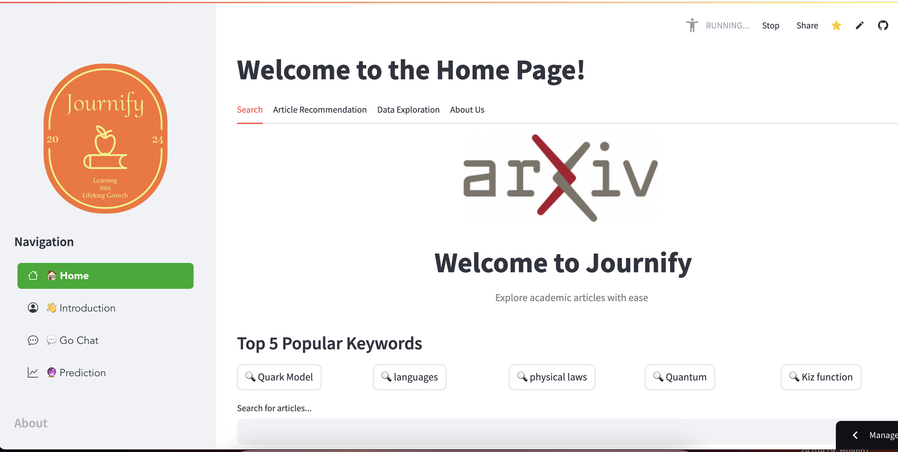

# Journify - Intelligent Journal Explorer

Explore the world of academic research with **Journify**, an AI-powered platform for article recommendations and a smart Q&A chatbot tailored to your interests in the arXiv repository.

## Cool features:

    - Fast and Intelligent Search: Our search engine provides quick results with accurate keyword matching and similar keyword detection, making it easy to find what you’re looking for.
    - Personalized Recommendations: We offer both content-based and customer-based recommendation algorithms to deliver tailored suggestions that match your interests and needs.
    - Comprehensive Data Exploration: Explore your data through user-friendly tabs with clear and visually appealing graphics to better understand and analyze information.
    - AI-Driven Chatbot Support: Our chatbot, powered by GPT-4, helps explain complex concepts and provides quick solutions to your problems, streamlining your workflow.
    - Trend Prediction Insights: Stay informed about trends in publications and potential attacker activities, giving you an edge in preparation and planning.
    - Sentiment Analysis for Feedback: Analyze comments and feedback with sentiment analysis to evaluate user opinions and improve journal quality effectively.

## User Interface Preview

<p align="center">
    
    <br/>
    <em>Figure 1: The demo app visualizes user data and provides real-time interactivity through dynamic plots and charts.</em>
    <br/>
    
    
    
    
    
    
    
    
    
    
    
    
    
    
    
    
</p>

## Running at:

    -[Access the app via the streamlit](https://journify-imp.streamlit.app/)
    - [Your local machine at the port 8501](http://0.0.0.0:8501/)

---

## Description

Journify is designed to provide researchers, students, and enthusiasts with the most relevant academic articles and a chatbot that answers questions on various subjects. Leveraging cutting-edge AI and machine learning models, Journify offers a unique, personalized research experience.

In the world of academic papers, finding the right articles can be challenging. Existing systems may recommend articles based on general popularity rather than your specific needs. Journify changes this by using techniques like **KNN** for subject classification, **Bayesian Search** for query optimization, and **HNSW-ANN** with **BERT** embeddings (via Weaviate) for fast and accurate recommendations. Additionally, **LLM + RAG** (Retriever-Augmented Generation) powers our Q&A chatbot, answering questions based on article content.

---

## How Journify Works

- **K-Nearest Neighbors (KNN)** for categorizing articles by subject to ensure that you find exactly what you're looking for.
- **Bayesian Search** for an intelligent querying experience, adapting results based on probability and relevance.
- **HNSW-ANN and BERT embeddings** using Weaviate to enable high-accuracy article recommendations.
- **LLM + RAG** for an interactive Q&A chatbot, which answers your queries about the recommended articles.

With these advanced techniques, Journify delivers tailored recommendations and insights to enhance your research journey.

---

### Table of Contents

- **[Installation](#installation)**
- **[Usage Instructions](#usage-instructions)**
- **[Dataset](#about-the-dataset)**

---

## Installation

Journify requires several Python libraries, including Streamlit for the app interface, Weaviate for embedding-based recommendations, and SQLite3 for fast, efficient access to the article database. Install all necessary dependencies with the following command:

```bash
pip install -r requirements.txt
```

Key Dependencies

- Streamlit: Renders the web interface and allows interactive exploration.
- Weaviate: Manages vector embeddings for advanced recommendation capabilities.
- SQLite3: Provides a lightweight, fast-access database for article storage and retrieval.
- BeautifulSoup: Useful for parsing data and scraping additional information if needed.

## Usage Instructions

Types of Recommendations

1. Content-based Recommendations: Journify uses metadata from arXiv articles (e.g., subjects, keywords, authors) to recommend similar articles based on the content of a particular item. If you're interested in a specific topic or author, Journify will suggest relevant papers tailored to that interest.
   Collaborative Filtering:
2. For users who have provided feedback on articles, collaborative filtering predicts preferences by looking at ratings and preferences from other users with similar interests. This system identifies patterns in user behavior to provide more refined recommendations.
   Simple Recommenders:
3. Sometimes, simplicity is best. Simple recommenders offer popular and trending articles across arXiv. Journify's simple recommender highlights articles that are frequently cited or widely read, making it easy for users to discover prominent papers in the field.
   Q&A Chatbot:
4. Journify’s Q&A chatbot, powered by LLM + RAG, allows you to ask questions about specific research topics or articles. The chatbot uses Retriever-Augmented Generation to pull the most relevant information from articles, providing quick and informative answers.

## About the Dataset

The Journify platform is powered by the arXiv dataset, which contains comprehensive data about research articles, including:

- Article Metadata: Information such as titles, authors, abstracts, subjects, keywords, and publication dates.
- User Interaction Data: Feedback from users (e.g., ratings, likes) helps enhance collaborative filtering recommendations.
- Financial phrasebank: https://huggingface.co/datasets/takala/financial_phrasebank

The arXiv dataset provides a rich source of data for generating recommendations, enabling Journify to bring you the latest and most relevant research articles from a wide array of scientific domains.

# Getting Started with Journify

- Start the Streamlit App:

```bash
streamlit run app.py
```

- Explore Articles: Use the sidebar to filter by topic, author, or other metadata. Journify will display articles based on your selected preferences and interests.
- Chat with the Q&A Bot: Ask questions about a particular topic, and the chatbot will provide answers based on the content of arXiv articles.
